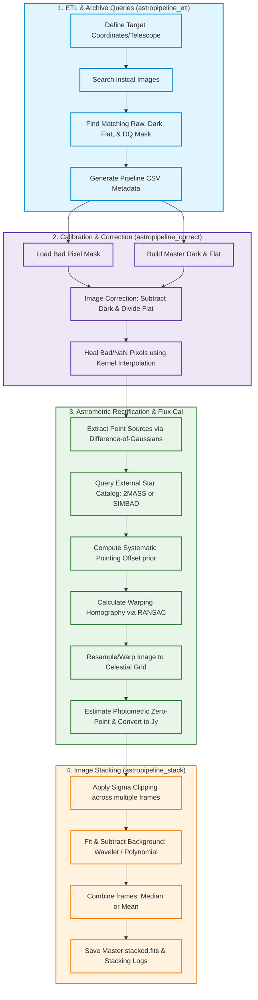

# Pipeline Architecture & Workflows

The `doverAstroPipeline` is composed of discrete functional stages that take raw images from an archive and produce science-ready stacked images. The diagram below illustrates the comprehensive workflow.

---

## High-Level Workflow Diagram

---

## Detailed Component Workflows

### 1. ETL & Archive Ingestion
The process begins in `astropipeline_etl.py` with `PipeStudy` and helper functions:
* **`find_instcals`:** Sends a POST request to the NoirLab ADV search endpoint to locate processed images matching telescope, instrument, exposure, and filter criteria.
* **`find_precal_match`:** For a given processed science image, queries the archive headers to locate the corresponding **raw image**, **dark frames**, **dome flats**, and **data quality mask (`dqmask`)** that were originally taken in the same observation cycle.
* **`cached_fits_open`:** To optimize performance, images are downloaded and stored locally in a `fits/cache` directory. Subsequent reads retrieve files directly from this cache, avoiding repeated network overhead.

### 2. Instrument Calibration & Pixel Healing
Once all raw and calibration files are ingested, `astropipeline_correct.py` handles detector signatures:
* **Bad Pixel Masking:** The `dqmask` is parsed to find invalid sensor regions.
* **Dark Correction:** Accumulates a randomized subset of dark frames, computes a mean dark image, and subtracts it from the raw frame.
* **Flat Calibration:** Accumulates flat frames, subtracts the mean dark, calculates a normalized master flat (gain) matrix, and divides the dark-corrected science image by the flat field.
* **Pixel Healing (`heal_pixels`):** Any NaN values or bad pixels masked by the `dqmask` are filled using localized 2D interpolation (via an Astropy `Box2DKernel` boundary convolution), falling back to the global mean if needed.

### 3. Rectification, Star Alignment, & Flux Calibration
To stack multiple frames, they must be registered to the exact same celestial grid. 

* **Point Source Detection (`astropipeline_measure.py`):** Uses multi-scale Difference-of-Gaussians (`dog_2d`) filtering to find coordinates of stellar point sources in the calibrated image.
* **Catalog Query:** Queries `SIMBAD` or `2MASS` catalog stars in the image's coordinate bounds.
* **pointing Offset Calculation (`calculate_global_pointing_offset`):** Calculates systematic translations between predicted catalog pixel locations and detected point sources across all FITS extensions.
* **RANSAC Homography (`rectify_catalog`):** Shifted catalog positions are matched with the nearest detected stars. A homography mapping matrix is computed using RANSAC to eliminate mismatch outliers and correct for higher-order optical distortions.
* **Warping / Resampling:** Interpolates the frame data onto a clean rectilinear target WCS grid.
* **Flux Calibration (`calibrate_flux`):** Calculates the photometric zero-point (`PHOTZP`) by cross-matching the counts of detected stars with their actual catalog magnitudes. An iterative $2\sigma$ outlier rejection is applied. Finally, pixel counts are multiplied by the scale factor:
  $$\text{Scale Factor} = 3631.0 \times 10^{-0.4 \times \text{PHOTZP}}$$
  This converts the values into absolute flux units of **Janskys (Jy)**.

### 4. Co-addition & Stacking
With all frames calibrated and astrometrically aligned, `astropipeline_stack.py` performs the stacking:
* **Sigma Clipping:** For each pixel location, values across all input frames are compared. Values that deviate by more than the specified threshold ($3\sigma$ by default) are masked out to remove transient artifacts like cosmic rays, satellites, or bad pixels.
* **Background Subtraction:** Fits and subtracts background emissions using either:
  * **Wavelet Decomposition (Default):** Decomposes the image using 2D wavelets, zeroes out high-frequency detail coefficients, and reconstructs the background.
  * **Polynomial Fitting:** Fits a 2D polynomial (up to degree 7).
* **Combination:** Combines the remaining pixel values using a pixel-by-pixel `median` or `mean` calculation.
* **Output Generation:** Writes the resulting co-added array to a FITS file, plots a preview PNG, and generates a detailed audit log `stacking_pipeline.log`.
